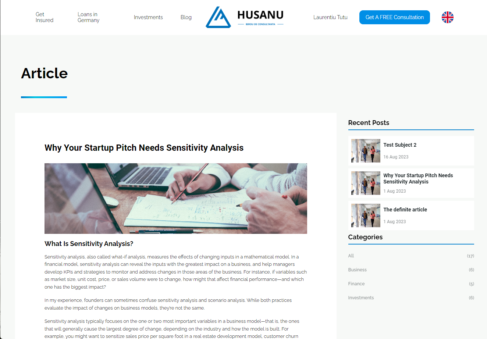

# Husanu

This project has been made with the purpose of making appointments for Consulting Services and also has a blog section where the admin can add articles.

## Requirements

For this project you will need:

- Node v12.18.0
- Yarn

## Project setup

To install the necessary libraries and dependencies you can use:

```
yarn install
```

To run this project in dev mode:

```
yarn dev
```

To build the project for production:

```
yarn build
```

## Key features

In this project you can find features like:

- Authentication system with JWT
- Multilanguage support with state that persists on page reload using i18n
- Advanced calendar with custom rules
- Blog comment section with replies
- Consuming REST API using Axios
- Routing using Vue Router
- State Management using Vuex
- Form Validation
- Custom reusable components made with Vue.JS & SCSS
- Admin Panel for easy platform management
- Responsive design

...and many more!

## Demos

### Home Page

#### Welcome Screen

Simple and elegant welcome screen for clients with multilanguage component pinned in header that adds selected language in link.


#### Our Services

Section of services provided by the company. Every category from the left changes the details on the right when selected.


#### How it Works

Steps added by the company showing their protocol in consulting. Every step is a custom reusable component.


### Insurances Page

#### Personal Insurances

Categories and subcategories of personal insurances that has a detailed description, using specific components for maintaining same pattern across the platform.


#### Company Insurances

##### Top advantages

Section about company insurances that displays top advantages.


##### What Includes

Slider of different types of company insurances that displays perks for each insurance.


### Blog Page

List of articles available on platform. It is paginated for optimizing loading time and persists on page reload. List can also be filtered by categories of articles.


### Article Page

The page which contains the details about the article. It also has a comment section with reply possibility at the end of article.



### Appointment Page

Section where you can create a new appointment that is required to confirm it through email. It uses a complex calendar that can have certain disabled days according to rules and exception you make in the admin panel.


### ADMIN Section

#### Employees Section

Page for managing employees. You can change privileges, give blog access for posting new articles or manage comments and also see accounts confirmed via email.


#### Bookings Section

You can assign bookings to employees and also add or remove rules and exeptions in the calendar.

##### Bookings Assignments


##### Bookings Rules


##### Bookings Exceptions


#### Blog Section

You can manage every article available on the platform. You can add new categories, you can add new arcicles and you can as well manage which comments should be approved on platform.

